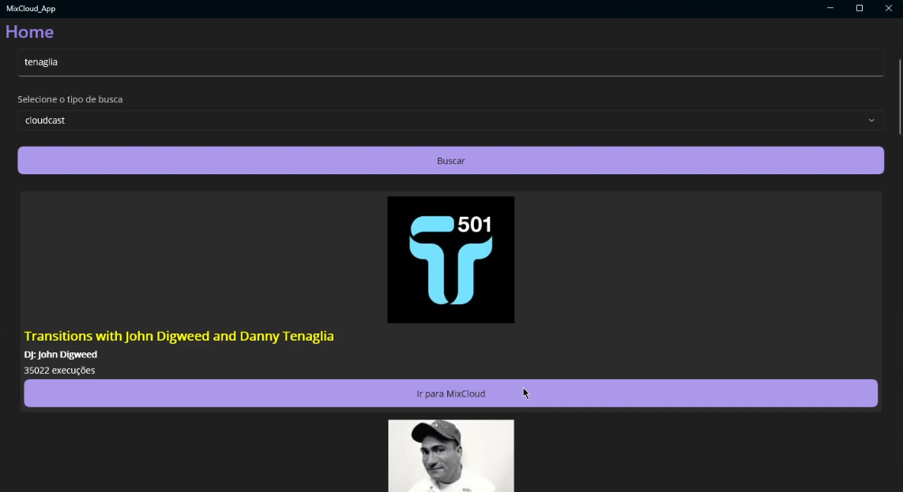

# MIXCLOUD-MAUI-XAML

Example of using the MixCloud API with Shows query (with MAUI + xaml)

## What's done:

- Model Creation
- Main Layout
- Results Listing

## What remains to be finished:

- Extend queries to other types, such as artist, labels, etc.

## Challenges:

- Uploading shows
